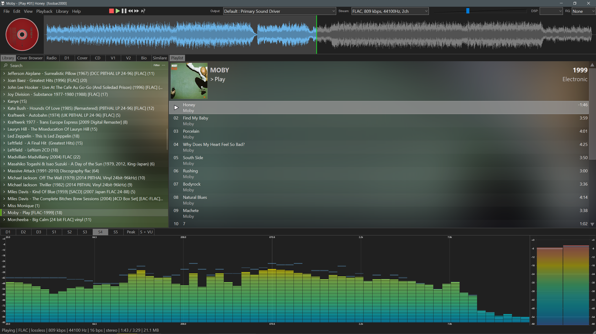

# "Cyberman-Dynamic" Skin Theme for Foobar2000 2.0+ 64Bit and 32bit DUI
Simple cool layout using the default user interface using plugins and scripts for the 64bit or 32biy version of foobar2000 2.0+ portable mode. 
You may need to adjust the layout box sizes for your monitor resolution. default 1440p

  

  
  
  

##       

## Quick install Guide using my profile folder  
 
Download and extract Foobar to a folder, Foobar2000 64bit https://www.foobar2000.org/windows  
 
Profile Folder and potable mode file, extract to Foobar2000 Root Folder (e.g. Foobar2000/profile) and start Foobar  
https://drive.google.com/file/d/17c2RMuAsf7-hlYvNjceFJV0pgC-KuH9J/view?usp=sharing 
 
You will need to sign up to last.fm for an API key for the Bio(right click set API) and Album cover art scrapper, https://www.last.fm/api    
 

##

Includes Various scripts and additions that have been developed by many coders helping the community on the 
[Hydrogenaudio Foobar2000 Forum](https://hydrogenaudio.org/index.php?board=28.0)

Waveform Minibar (mod) https://www.foobar2000.org/components/view/foo_wave_minibar_mod

Analog VU Meter Visualisation https://www.foobar2000.org/components/view/foo_vis_vumeter

Spectrum Analyzer https://www.foobar2000.org/components/view/foo_vis_spectrum_analyzer

Spider Monkey Panel https://github.com/marc2k3/spider-monkey-panel-x64/releases  

Jscript panel 3, https://hydrogenaudio.org/index.php/topic,110516.msg1067716.html#msg1067716 

many audio output options and audio codecs added from the foobar2000 components https://www.foobar2000.org/components

##
# Full Manual Installation Guide
##

Download and extract to a folder, Foobar2000 64bit https://www.foobar2000.org/windows  

Add this file to the Foobar root folder (eg. Foobar2000/portable_mode_enabled.file) to use Foobar in portable mode 
[portable_mode_enabled.file](https://github.com/JBW-byte/Modern-Classic-RGB-Foobar2000-2.0-64bit/blob/main/portable_mode_enabled). 
 
##
### you will need to Download these Foobar2000 Component plugins.    
Jscript panel 3 https://hydrogenaudio.org/index.php/topic,110516.msg1067716.html#msg1067716 

Waveform Minibar (mod) https://www.foobar2000.org/components/view/foo_wave_minibar_mod

Analog VU Meter Visualisation https://www.foobar2000.org/components/view/foo_vis_vumeter

Spectrum Analyzer https://www.foobar2000.org/components/view/foo_vis_spectrum_analyzer

Spider Monkey Panel https://github.com/marc2k3/spider-monkey-panel-x64/releases  

Install -> open Foobar goto file/prefrences click components and select install, select all the plugins you have downloaded and click open and apply, foobar will restart.
##
 
VU skin, extract zip to foobar2000/components 

Scripts i use:-

https://hydrogenaudio.org/index.php/topic,111060.msg1073729.html#msg1073729 Libray Tree mod34, spider monkey panel

To install the theme goto Prefrences, Default User Interface and click import theme, select the .fth file, you will need to use dark mode in foobar(display menu/colors and font) or on your desktop to match the borders.

https://github.com/JBW-byte/Modern-Classic-RGB-Foobar2000-2.0-64bit/blob/main/Modern_Classic_RGB_Foobar_64bit.fth 
 
 

you will need to install these font's to see some icons maybe  
https://github.com/TheQwertiest/CaTRoX_QWR/blob/master/fonts/fontawesome.ttf
https://github.com/TheQwertiest/CaTRoX_QWR/blob/master/fonts/Guifx%20v2%20Transports.ttf

