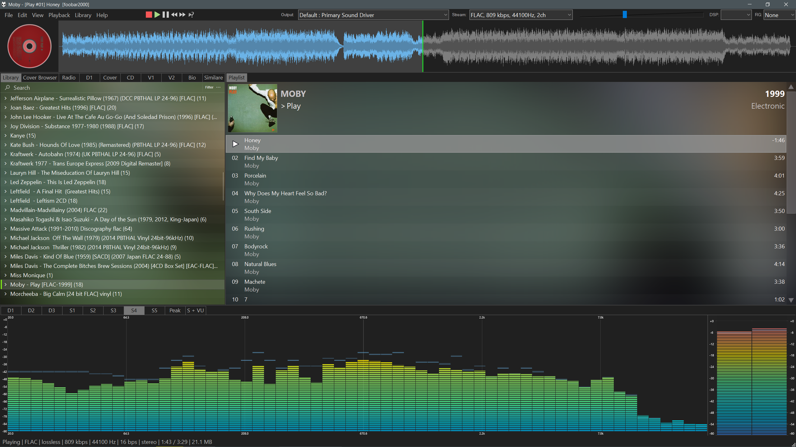

# Cyberman-Dynamic Skin Theme for Foobar2000 2.0+ (64-bit)

**Cyberman-Dynamic** is a clean, modern Foobar2000 skin built on the **Default User Interface (DUI)** for **Foobar2000 2.0+ 64-bit**, designed for **portable mode**.

It features a **dynamic colour scheme based on album artwork**, custom playback controls, multiple VU meter skins, and configurable spectrum and layout presets.

> **Last updated:** 19 March 2026 Added LCD Timer and 2nd Theme Layout. Updated componets/scripts

---

## Features

* Dynamic colour scheme derived from the currently playing album art
* Multiple layouts with custom spectrum analyzer presets
* Custom play buttons and volume knob
* Disk spinner panel (album art or CD-style disc)
* Artwork blur panel
* Multiple VU meter skins
* Right-click configuration options on custom panels

**Display notes:**

* Default layout is designed for **1440p** displays
* You may need to resize layout boxes for other resolutions

---

## Screenshots

  
  
  

---

## Artwork & Disc Media

* Disc artwork files must be named one of the following:

  * `media`, `disc`, `vinyl`, `cd`, `CD`, `Media`, `Disc`, `Vinyl`,
* Supported formats: `.jpg` `.png` `.jpeg` `.webp` `.bmp`
* Artwork **Multiple locations supported, any sub folder in a named folder** some edge cases might not work depending on naming.
* Disc masking is applied automatically to generate disc visuals from album art

---

# Quick Install (Recommended)

This method uses a preconfigured **profile folder**.

1. Download and extract **Foobar2000 64-bit**:

   * [https://www.foobar2000.org/windows](https://www.foobar2000.org/windows)

2. Download the profile folder and portable mode file:

   * [https://drive.google.com/file/d/1rbt565eTzlPOWeJIfT3RrfoZncBm9rTf/view](https://drive.google.com/file/d/1rbt565eTzlPOWeJIfT3RrfoZncBm9rTf/view)

3. Extract the contents directly into your Foobar2000 root directory (e.g. `Foobar2000/`).

4. Launch Foobar2000.

5. On first launch, add your media library:

   * `File → Preferences → Media Library → Add (+) Folder`

### Optional: Automatic Artwork Fetching.

If your library has missing or incompatible artwork:

Album Artwork Downloader is a good option for artwork downloads.  
Added Biography-v1.4.2.mod.29, for artwork that downlaods a cover to your music folder.  
2nd minimal theme * `File → Preferences → Display → Default User Interface → Import Theme` Cyberman-Dynamic-V2.ftl  

* A **Last.fm API key** is required for some options:

  * [https://www.last.fm/api](https://www.last.fm/api)

---

## Fonts (Required for Icons)

Some UI icons require additional fonts:

* [https://github.com/regorxxx/foobar2000-assets/tree/main/Fonts](https://github.com/regorxxx/foobar2000-assets/tree/main/Fonts)
* [https://www.fontrepo.com/font/27754/guifx-v2-transports](https://www.fontrepo.com/font/27754/guifx-v2-transports)

Install the `.ttf` files into your system fonts directory.

---

## Credits & Dependencies

This theme includes and depends on community-developed components and scripts from the
[Hydrogenaudio Foobar2000 Forum](https://hydrogenaudio.org/index.php?board=28.0).

### Required Components

* **Waveform Minibar (mod)** — Case
  [https://www.foobar2000.org/components/view/foo_wave_minibar_mod](https://www.foobar2000.org/components/view/foo_wave_minibar_mod)

* **Analog VU Meter Visualization** — oops
  [https://www.foobar2000.org/components/view/foo_vis_vumeter](https://www.foobar2000.org/components/view/foo_vis_vumeter)

* **Spectrum Analyzer** — pqyt
  [https://www.foobar2000.org/components/view/foo_vis_spectrum_analyzer](https://www.foobar2000.org/components/view/foo_vis_spectrum_analyzer)

* **Spider Monkey Panel (64-bit)** — marc2k3
  [https://github.com/marc2k3/spider-monkey-panel-x64/releases](https://github.com/marc2k3/spider-monkey-panel-x64/releases)

* **Library Tree SMP** — regor
  [https://github.com/regorxxx/Library-Tree-SMP](https://github.com/regorxxx/Library-Tree-SMP)
### Optional Components

* Additional audio outputs and codecs:
  [https://www.foobar2000.org/components](https://www.foobar2000.org/components)

* SACD Decoder:
  [https://sourceforge.net/projects/sacddecoder/](https://sourceforge.net/projects/sacddecoder/)   

---
# Full Manual Installation

Use this method if you prefer a clean or custom setup.

### 1. Install Foobar2000

Download and extract **Foobar2000 64-bit**:

* [https://www.foobar2000.org/windows](https://www.foobar2000.org/windows)

Enable portable mode by adding this file to the Foobar2000 root folder:

* [https://github.com/JBW-byte/Modern-Classic-RGB-Foobar2000-2.0-64bit/blob/main/portable_mode_enabled](https://github.com/JBW-byte/Modern-Classic-RGB-Foobar2000-2.0-64bit/blob/main/portable_mode_enabled)

### 2. Install Components

Download the required components listed above.

Install them via:

* `File → Preferences → Components → Install`

Select all downloaded component files, apply changes, and restart Foobar2000.

---

### 3. Install Scripts & Skins

* Extra scripts and images:

  * [https://github.com/JBW-byte/Cyberman-Dynamic-Foobar2000-Theme/blob/main/scripts_extra.zip](https://github.com/JBW-byte/Cyberman-Dynamic-Foobar2000-Theme/blob/main/scripts_extra.zip)
  * Extract to `Foobar2000/profile/`

* VU Meter skins:

  * [https://github.com/JBW-byte/Cyberman-Dynamic-Foobar2000-Theme/blob/main/vumeter.zip](https://github.com/JBW-byte/Cyberman-Dynamic-Foobar2000-Theme/blob/main/vumeter.zip)
  * Extract to `Foobar2000/profile/`

---

### 4. Install Theme

1. Download the theme file:

   * [Original Cyberman-Dynamic.fth](https://github.com/JBW-byte/Cyberman-Dynamic-Foobar2000-Theme/blob/main/Cyberman-Dynamic.fth)
   * [Minimal and artwork downlaod Cyberman-Dynamic_V2.fth](https://github.com/JBW-byte/Cyberman-Dynamic-Foobar2000-Theme/blob/main/Cyberman-Dynamic.fth)

2. Import the theme:

   * `File → Preferences → Display → Default User Interface → Import Theme`

---

### 5. Library Panel Setup

On first load, errors may appear due to the Library Tree panel not being configured.

1. Go to the **Library** tab
2. Right-click the panel → **Configure Panel**
3. Select **Package → Import**
4. Locate `Library-Tree-SMP-package.zip` (recommended location: `profile/packages/`)
5. Click **OK**

Re-import the theme file to fully activate the layout.

---

### 6. Spectrum Presets

Spectrum presets are included in the theme but can be overridden.

Optional presets:

* [https://github.com/JBW-byte/Cyberman-Dynamic-Foobar2000-Theme/blob/main/Spectrum%20preset.zip](https://github.com/JBW-byte/Cyberman-Dynamic-Foobar2000-Theme/blob/main/Spectrum%20preset.zip)

Extract to the `profile/` folder.

---

### Appearance Notes

* Enable **Dark Mode** in:

  * `Preferences → Display → Colors and Fonts`
* Alternatively, use a system-wide dark desktop theme
* This ensures borders and panel colors match the intended design

---

## License

This theme is shared for Personal use Only. Individual components remain licensed under their respective authors.

---

## Acknowledgements

Thanks to the Foobar2000 Devs and modding community and all script and component authors who made this theme possible.
